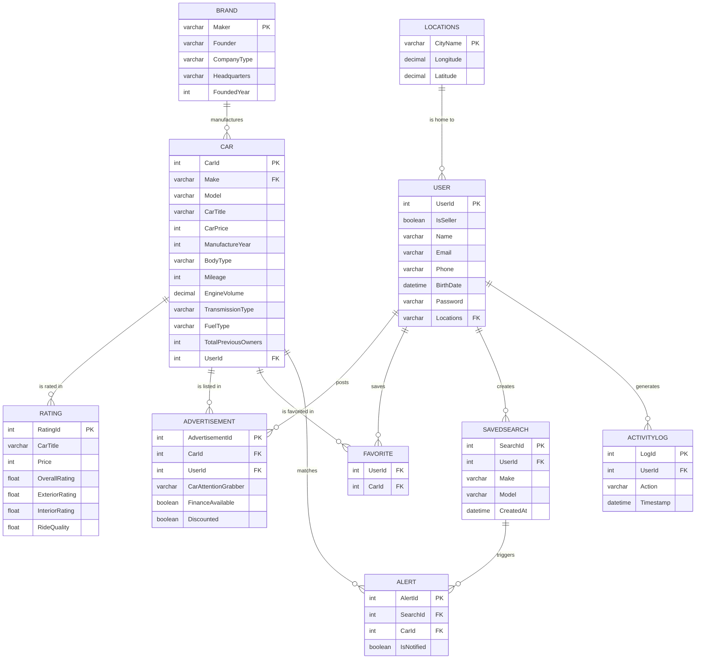

# Used Car Market Analysis & Recommendation System

> A full-stack web application for browsing, listing, rating, and analyzing the
> used-car market — built on a fully normalized MySQL database with stored
> procedures, triggers, and transactional integrity. Final project for
> **CS 411: Database Systems** at the University of Illinois Urbana-Champaign
> (Team 080 – *yoyo*).

<p align="left">
  
  
  
  
  
  
</p>

<p align="left">
  <a href="https://youtu.be/Z-wose2pUlA">
    
  </a>
</p>

> **🎬 Demo video:** [youtu.be/Z-wose2pUlA](https://youtu.be/Z-wose2pUlA)

---

## Table of Contents

- [Overview](#overview)
- [Features](#features)
- [Advanced Database Techniques](#advanced-database-techniques)
- [Tech Stack](#tech-stack)
- [Architecture](#architecture)
- [Database Design](#database-design)
- [Datasets](#datasets)
- [Getting Started](#getting-started)
- [API Reference](#api-reference)
- [Project Structure](#project-structure)
- [Future Work](#future-work)
- [Team](#team)
- [Acknowledgments](#acknowledgments)

---

## Overview

The used-car market overwhelms buyers with scattered listings, inconsistent
information, and no easy way to compare prices or reliability across models.
This project centralizes car listings, brand data, owner reviews, and location
data into a single, queryable web application — and adds search alerts,
favorites, and market-analysis tools on top.

The system is built around a **relational data model designed and normalized
to 3NF/BCNF**, integrating three real-world public datasets. The backend is a
**Node.js + Express application following the MVC pattern**, with a MySQL data
layer that leverages **stored procedures, triggers, and transactions** — not
just basic CRUD. The front end is server-rendered with EJS and styled with
Bootstrap.

---

## Features

| Feature | Description |
| ------- | ----------- |
| **User accounts** | Session-based registration, login, logout, and profile management with ownership-protected updates. |
| **Car listings** | Browse all cars, view detailed pages, and (for sellers) create new car records. |
| **Advanced filtering** | Multi-criteria search by make, model, price range, manufacture-year range, body type, fuel type, and transmission, composed dynamically into a single parameterized query. |
| **Saved searches & alerts** | Users save searches; a notification system surfaces newly matched listings with an unread-count badge and a matched-cars list. |
| **Price-trend analysis** | Each car detail page shows average price by manufacture year for that make/model, computed via aggregate SQL. |
| **Preference / market analysis** | A stored-procedure-driven chart analyzes purchase patterns by buyer **location** and **age range**. |
| **Ratings & reviews** | Submit and view ratings across overall, exterior, interior, and ride-quality dimensions per car. |
| **Favorites** | Add/remove favorite cars, with each action recorded atomically alongside an activity log. |
| **Advertisements** | Full create/read/update/delete of marketplace listings, restricted to the owning user. |
| **Activity log** | User actions (e.g., favoriting a car) are persisted and shown as recent activity. |

---

## Advanced Database Techniques

This being a database-systems course, the data layer goes well beyond simple
queries:

- **Stored procedures** — `GetCarPurchasesByLocationAndAge` powers the
  preference-analysis feature, encapsulating analytical logic in the database.
- **Triggers** — automate alert/notification bookkeeping when relevant rows
  change.
- **Transactions with isolation levels** — adding a favorite inserts into both
  `Favorite` and `ActivityLog` inside a single transaction
  (`READ COMMITTED`, with explicit `COMMIT`/`ROLLBACK`), guaranteeing atomic,
  consistent writes.
- **Constraints & referential integrity** — primary/foreign keys enforce valid
  relationships across users, cars, brands, and ratings.
- **Indexing** — frequently filtered attributes (e.g., price, mileage) are
  indexed to accelerate common queries.
- **Parameterized queries** — all user input flows through bound parameters to
  guard against SQL injection.

---

## Tech Stack

| Layer            | Technology                                       |
| ---------------- | ------------------------------------------------ |
| Runtime          | Node.js                                          |
| Web framework    | Express 4                                        |
| Sessions         | express-session                                  |
| Database         | MySQL 8 (`mysql2/promise` connection pool)       |
| Templating       | EJS (with partials)                              |
| Styling          | Bootstrap 5                                      |
| HTTP client      | axios                                            |
| Configuration    | dotenv                                           |
| Dev tooling      | nodemon                                          |
| Architecture     | Model–View–Controller (MVC)                      |

---

## Architecture

The backend follows a layered MVC design. Routes delegate to controllers, which
hold business logic and session handling; controllers call models, which own all
SQL; models talk to MySQL through a shared connection pool.

```
                 HTTP Request
                      │
                      ▼
             ┌─────────────────┐
             │     Routes      │  user · car · advertisement · rating
             │                 │  preference · search · alert · filter · favorite
             └────────┬────────┘
                      ▼
             ┌─────────────────┐
             │   Controllers   │  request/response, sessions, ownership checks
             └────────┬────────┘
                      ▼
             ┌─────────────────┐
             │     Models      │  parameterized SQL, stored procedures, transactions
             └────────┬────────┘
                      ▼
             ┌─────────────────┐
             │  mysql2 Pool    │  (DB/db.js)
             └────────┬────────┘
                      ▼
             ┌─────────────────┐
             │      MySQL      │  tables · stored procedures · triggers
             └─────────────────┘

   Views (EJS + Bootstrap)  ◀── rendered by Express; static assets from /public
```

---

## Database Design

The schema was designed from real datasets and normalized — five core relations
satisfy **BCNF** and all satisfy **3NF**. Beyond the original six entities, the
implemented system adds operational tables for favorites, saved searches,
alerts, and activity logging.



Full entity descriptions, the relational schema, functional dependencies, and
normalization proofs are in the [`doc/`](./doc) directory (see
[`doc/stage2.md`](./doc/stage2.md) and the project report).

---

## Datasets

The core relations are populated from three public Kaggle datasets:

| Dataset                     | Maps to     | Source |
| --------------------------- | ----------- | ------ |
| Car Companies in the World  | `Brand`     | [Kaggle](https://www.kaggle.com/datasets/shiivvvaam/car-companies-in-the-world) |
| Car Rating Dataset          | `Rating`    | [Kaggle](https://www.kaggle.com/datasets/juhibhojani/car-rating) |
| Geolocation Dataset         | `Locations` | [Kaggle](https://www.kaggle.com/datasets/liewyousheng/geolocation/data) |

---

## Getting Started

### Prerequisites

- [Node.js](https://nodejs.org/) (v18 or later recommended)
- A running [MySQL](https://www.mysql.com/) 8.x instance
- npm (bundled with Node.js)

### Installation

```bash
# 1. Clone the repository
git clone https://github.com/GuanHongLin1120/CS411_UsedCarTradingWebsite.git
cd CS411_UsedCarTradingWebsite/app/server

# 2. Install dependencies
npm install
```

### Database setup

1. Create the schema/database named `used_car` in your MySQL instance.
2. Create the tables, stored procedures, and triggers (schema in
   [`doc/stage2.md`](./doc/stage2.md) and the project report).
3. Load the datasets above into the corresponding tables.

### Environment variables

Create a `.env` file inside `app/server/` (git-ignored):

```env
DB_HOST=localhost
DB_USER=your_mysql_user
DB_PASSWORD=your_mysql_password
DB_NAME=used_car
```

### Run

```bash
npm start
```

The server starts on **http://localhost:3000**.

---

## API Reference

### Pages (HTML)

| Method | Endpoint                    | Description                       |
| ------ | --------------------------- | --------------------------------- |
| `GET`  | `/`                         | Landing page                      |
| `GET`  | `/login`                    | Login page                        |
| `GET`  | `/user/register`            | Registration page                 |
| `GET`  | `/user/profile`             | User dashboard (cars + ads)       |
| `GET`  | `/user/userInfo`            | User info page                    |
| `GET`  | `/filter`                   | Filter form                       |
| `GET`  | `/favorite`                 | Favorites + recent activity       |
| `GET`  | `/preference`               | Preference analysis page          |
| `GET`  | `/advertisement/Create/:id` | Create-ad form for a car          |
| `GET`  | `/advertisement/detail/:id` | Advertisement detail page         |

### Data & actions (JSON / redirects)

| Method | Endpoint                    | Description                                |
| ------ | --------------------------- | ------------------------------------------ |
| `GET`  | `/session`                  | Current login state                        |
| `POST` | `/user/register`            | Create an account                          |
| `POST` | `/user/login`               | Authenticate and start a session           |
| `GET`  | `/user/logout`              | Destroy the session                        |
| `GET`  | `/user/:id`                 | Fetch a single user                        |
| `POST` | `/user/:id`                 | Update own profile (ownership-checked)     |
| `GET`  | `/car`                      | List all cars                              |
| `POST` | `/car`                      | Create a car listing                       |
| `GET`  | `/car/:id`                  | Car detail + price trend                   |
| `POST` | `/search`                   | Store a saved search                       |
| `GET`  | `/alert`                    | Unread alert count (marks as notified)     |
| `GET`  | `/alert/all`                | Matched cars for the user's saved searches |
| `POST` | `/filter/results`           | Run a multi-criteria filtered search       |
| `GET`  | `/rating/:id`               | Ratings for a car                          |
| `POST` | `/rating`                   | Submit a rating                            |
| `POST` | `/preference`               | Preference analysis (stored procedure)     |
| `POST` | `/favorite/add/:carId`      | Add to favorites (transactional)           |
| `POST` | `/favorite/remove/:carId`   | Remove from favorites                      |
| `POST` | `/advertisement/:id`        | Create advertisement (ownership-checked)   |
| `GET`  | `/advertisement/:id`        | Get advertisement by id                    |
| `POST` | `/advertisement/update/:id` | Update advertisement (ownership-checked)   |
| `POST` | `/advertisement/delete/:id` | Delete advertisement (ownership-checked)   |

---

## Project Structure

```
sp25-cs411-team080-yoyo/
├── app/
│   ├── server/
│   │   ├── Controller/        # request handlers & business logic
│   │   │   ├── userController.js
│   │   │   ├── carController.js
│   │   │   ├── AdController.js
│   │   │   ├── ratingController.js
│   │   │   ├── favoriteController.js
│   │   │   ├── searchController.js
│   │   │   ├── alertController.js
│   │   │   └── PrefController.js
│   │   ├── Model/             # SQL queries, stored procedures, transactions
│   │   │   ├── userModel.js
│   │   │   ├── carModel.js
│   │   │   ├── AdModle.js
│   │   │   ├── ratingModel.js
│   │   │   ├── favoriteModel.js
│   │   │   ├── searchModel.js
│   │   │   └── alertModel.js
│   │   ├── Views/             # EJS templates
│   │   │   ├── partials/      # topbar, sidebar, footer
│   │   │   ├── MainPage.ejs · Login.ejs · Register.ejs
│   │   │   ├── FilterPage.ejs · FilterResults.ejs
│   │   │   ├── CarDetail.ejs · favorite.ejs · analysis.ejs
│   │   │   ├── AdvertisementForm.ejs · AdvertisementDetail.ejs
│   │   │   └── UserDashBoard.ejs · userInfo.ejs
│   │   ├── routes/            # Express routers
│   │   ├── DB/db.js           # MySQL connection pool
│   │   ├── index.js           # app entry point
│   │   └── package.json
│   └── public/                # static assets
│       └── CSS/  ·  JS/  ·  images/
├── doc/                       # design documents & project report
│   ├── stage2.md              # entities, schema, normalization
│   ├── Stage1_revisions.md
│   ├── Database Design.pdf
│   ├── Used Car Project ERD.drawio.pdf
│   └── Team080 - Project Report.pdf
├── TeamInfo.md
└── README.md
```

---

## Future Work

Improvements identified during the project retrospective:

- [ ] **Hash passwords** and add server-side input validation (currently a
  course-scope simplification).
- [ ] Complete the originally planned **hybrid recommendation engine** (the
  shipped version is a stored-procedure-based preference analysis).
- [ ] Add `avg_rating` / `review_count` columns to `Car`, maintained by a
  trigger on rating inserts, to avoid recomputing aggregates.
- [ ] Strengthen data validation and additional table constraints.
- [ ] Expand automated test coverage.

---

## Team

**CS 411 — Team 080 (yoyo)** · 🎬 [Demo video](https://youtu.be/Z-wose2pUlA)

| Role    | Name           | Email                    |
| ------- | -------------- | ------------------------ |
| Captain | Guan-Hong Lin  | gl48@illinois.edu        |
| Member  | Chia-Yu Wang   | chiayuw2@illinois.edu    |
| Member  | Nicole Chen    | yingder2@illinois.edu    |
| Member  | Chengzhe Li    | cli134@illinois.edu      |

---

## Acknowledgments

- Course staff of **CS 411: Database Systems**, University of Illinois
  Urbana-Champaign.
- Dataset authors on Kaggle (linked in [Datasets](#datasets)).

> Developed for academic purposes. Datasets are used under their respective
> Kaggle licenses.
